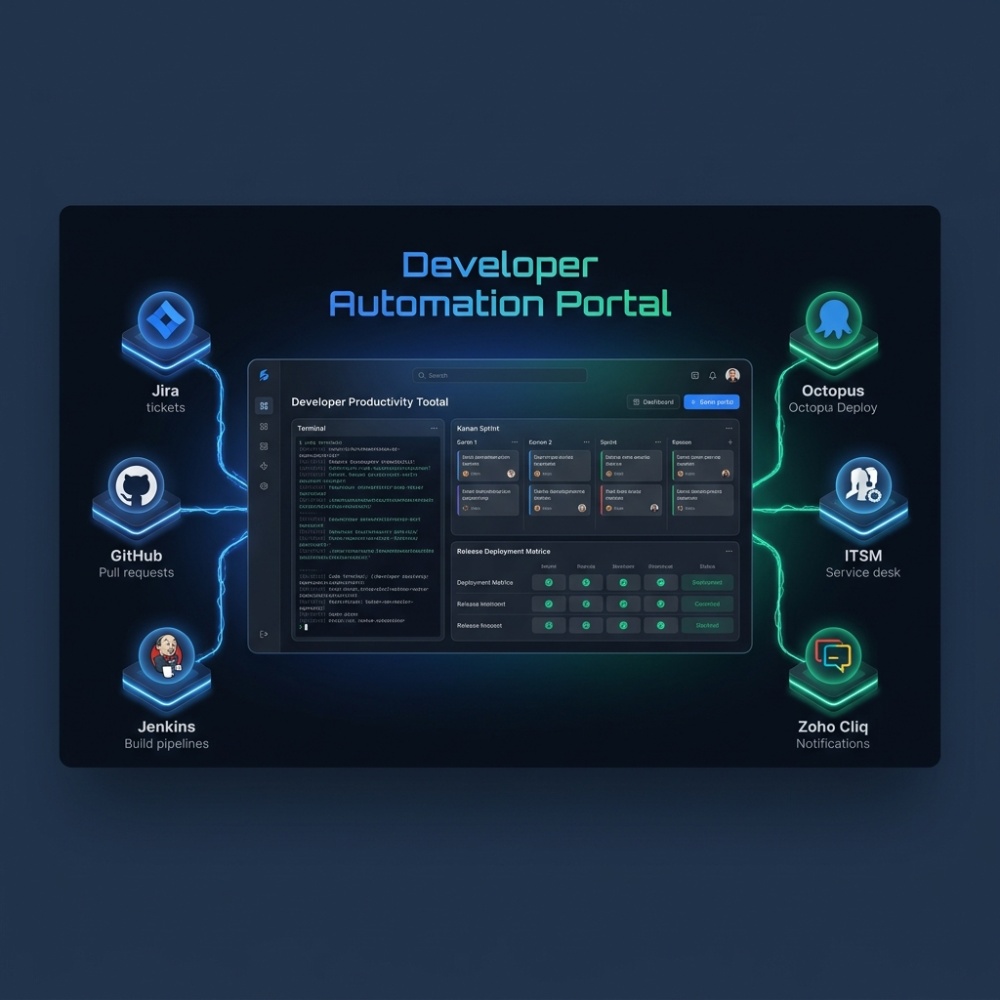

# Developer Automation Portal



A production-quality personal productivity dashboard and developer portal (similar to Backstage) that runs and tracks day-to-day operations, automation scripts, and integration services across JIRA, GitHub, Jenkins, Octopus Deploy, Zoho Cliq, CRM, and ITSM.

Built with **React 19**, **Vite**, **Material UI (MUI v6)** on the frontend, and a modular **FastAPI** + **SQLite** backend in Python.

Every integration runs in one of two modes automatically: **live** (real API calls) when credentials are present in `.env`, or **simulated** (local SQLite-backed fixture data) when they're not — so the app is fully explorable without any credentials at all.

---

## Key Features

### JIRA
- **View Ticket** — status/assignee editing, comments, worklogs.
- **Open Tickets** — Kanban board of your Backlog / To Do / Dev In Progress tickets.
- **Time Tracker** / **Sprint Board** — read-only analytics views.
- **Add / Delete Worklog**.
- **Push to QA** — paste a ticket URL, pick an environment (SIT / Pre-Prod / PROD) and a QA assignee, and it transitions the ticket's status, comments on it, reassigns it, and posts a Cliq notification — one action instead of several manual steps. QA assignees are configured on the **Team Contacts** page, not hardcoded.

### GitHub
- View / Approve Pull Request (full diff viewer with line comments).
- Create Branch, Create Release Tag (auto-suggests the next version).
- **Open PR Dashboard** — carousel of repos, your own open/closed PRs one per row, and a full review lifecycle: Approval → Review → SIT Branch → Merge → Close PR, with buttons enabled/disabled based on actual GitHub approval state. Approval/Review notifications go out over Cliq to peers configured on the **Team Contacts** page.

### DevOps
- **Jenkins Jobs Panel** — browse job folders and build status.
- **Octopus Deployments** — favorites-first project list, release × environment deployment matrix, deploy/redeploy.
- **Tag Sync Watcher** — poll Octopus for a SIT tag to finish syncing from GitHub, then auto-deploy it to SIT the moment it lands, with a native desktop notification when it's done.
- **Tag Promotion Watcher** — poll for a release tag, deploy it to SIT-β, then auto-promote to Pre-Prod once SIT-β succeeds (fast-polls SIT-β completion so it doesn't sit waiting on a slow interval).

### ITSM
- **ITSM Ticket Hub** — recent tickets with inline approve/comment.
- **Raise ITSM Request** — dynamic category form with file attachments.
- **Release Ticket** — files the real Jira Service Management "Release Management" request (not a generic issue — a proper Service Desk customer request, so it shows up correctly with its Request Type) for three configured repos. Github Release Tag / Github-Reverting-Tag auto-fill from live Octopus deployment data (what's currently in Pre-Prod / Prod). Below the repo picker, a searchable, paginated table lists every release ticket you've personally filed (`reporter = currentUser()`), with a click-through detail panel showing every field plus a Comments/Approvals toggle and an "Add Comment" action.

### CRM (BOB CRM) - Coming Soon
- Franchise Creation, Reseller Onboarding, Order Lookup (CSV bulk upload), Social Media Post.

### Reports
- **Monthly Report** — your current month's completed tickets, SIT issues, and Production issues (scoped to `assignee = currentUser()`), with click-through drill-down lists for Released, Ready For Testing, Reopened, Blocked, Dev In Progress, SIT Issues, and Production Issues.

### Platform
- Category dashboard grid with search, favorites, and recents.
- Command palette (`Cmd+K` / `Ctrl+K`).
- Settings page — edit credentials/base URLs from the UI, written straight to `backend/.env`.
- **Team Contacts** page — add, edit, or remove QA assignees, PR approval peers, and the PR reviewer directly from the UI; changes write straight to `backend/.env` and take effect immediately, no restart or code change needed.
- Execution audit log — every live API call's method, duration, status, payload, and response is recorded and viewable under **Logs**.

---

## Project Structure

```
dev-automation-portal/
├── .env.example
├── README.md
├── package.json          # Root npm package — orchestrates concurrent start
├── start.sh              # One-command setup + run
├── backend/
│   ├── requirements.txt
│   ├── .env              # Real config — copy from ../.env.example (see Configuration below)
│   └── app/
│       ├── main.py
│       ├── api/          # Route layers: jira, github, devops, crm, itsm, release_ticket, logs
│       ├── core/         # Settings (env loading), DB engine, logging
│       ├── clients/      # Thin HTTP wrappers per integration (Jira, GitHub, Jenkins, Octopus, Cliq)
│       ├── models/       # SQLite schemas for simulation data + audit logs
│       ├── schemas/      # Pydantic request/response models
│       └── services/     # Business logic — live vs. simulated branching lives here
└── frontend/
    ├── package.json
    ├── vite.config.ts    # Proxies /api requests to http://127.0.0.1:8000
    └── src/
        ├── components/   # Sidebar, Topbar, LogViewer, CommandPalette, result views
        ├── pages/        # Dashboard, ServiceRunner, Settings, Logs, Release Ticket, Octopus, etc.
        ├── services/     # Axios API client mappings
        └── utils/        # Service catalog config, feature-specific config (releaseTicketConfig, etc.)
```

---

## Prerequisites

- **Python 3.11+**
- **Node.js 18+** and npm
- macOS or Linux (the helper script targets bash; on Windows use the manual steps below or WSL)

---

## Getting Started

### Option 1: Fast Start (Recommended)

```bash
chmod +x start.sh
./start.sh
```

This creates the backend virtualenv, installs both backend and frontend dependencies, and starts both dev servers concurrently.

- Frontend: **http://localhost:5173**
- Backend API: **http://127.0.0.1:8000** (proxied through the frontend at `/api`)

The app works immediately in **simulated mode** with no configuration. To connect real services, see [Configuration](#configuration) below, then re-run `./start.sh` (or just restart the backend if it's already running).

### Option 2: Manual Step-by-Step

**Backend:**
```bash
python3 -m venv backend/venv
source backend/venv/bin/activate
pip install -r backend/requirements.txt
cd backend
uvicorn app.main:app --reload --port 8000
```

**Frontend** (separate terminal):
```bash
cd frontend
npm install
npm run dev
```

Then open **http://localhost:5173**.

---

## Configuration

Copy the example env file into `backend/.env` — **this is the file the app actually reads** (via `backend/app/core/config.py`), not a root-level `.env`:

```bash
cp .env.example backend/.env
```

Fill in whichever sections apply to you — every integration falls back to simulated mode independently if its keys are blank, so you can configure only what you need.

| Section | Required keys | Notes |
|---|---|---|
| JIRA | `JIRA_BASE_URL`, `JIRA_EMAIL`, `JIRA_API_TOKEN` | [Create an API token](https://id.atlassian.com/manage-profile/security/api-tokens) |
| GitHub | `GITHUB_TOKEN` | A classic or fine-grained PAT with `repo` scope |
| Jenkins | `JENKINS_URL`, `JENKINS_USER`, `JENKINS_TOKEN` | |
| Octopus Deploy | `OCTOPUS_URL`, `OCTOPUS_API_KEY` | |
| CRM | `CRM_BASE_URL`, `CRM_API_KEY` | |
| ITSM | `ITSM_BASE_URL`, `ITSM_API_KEY` | Typically the same Jira Service Management instance as above |
| Zoho Cliq (Push to QA / PR notifications) | `ZOHO_CLIENT_ID`, `ZOHO_CLIENT_SECRET`, `ZOHO_REFRESH_TOKEN` | OAuth self-client, not an Incoming Webhook — see below |
| Push to QA | `PUSH_TO_QA_ASSIGNEE_EMAIL`, `PUSH_TO_QA_ASSIGNEE_NAME` | Fallback default assignee, used only if no QA assignees are configured |

QA assignees, PR approval peers, and the PR reviewer are **not** fixed env keys — they're an open-ended numbered list (`QA_ASSIGNEE_1_NAME`/`_EMAIL`, `QA_ASSIGNEE_2_...`, `APPROVAL_PEER_1_...`, `PR_REVIEWER_NAME`/`_EMAIL`, etc.) managed from the in-app **Team Contacts** page (Settings → Team Contacts). Add or remove as many as you need there; it rewrites `backend/.env` directly with no restart required.

### Setting up Zoho Cliq (optional)

The Cliq integration uses an OAuth self-client (not a webhook), because it needs to post to a channel by name rather than a single fixed webhook target:

1. Create a self-client at [Zoho API Console](https://api-console.zoho.com/) with the `ZohoCliq.Channels.CREATE` and `ZohoCliq.Webhooks.CREATE` scopes (or broader Cliq scopes as needed).
2. Generate a grant token and exchange it for a refresh token (`grant_type=authorization_code` once, then reuse the refresh token going forward).
3. Set `ZOHO_CLIENT_ID`, `ZOHO_CLIENT_SECRET`, `ZOHO_REFRESH_TOKEN` in `backend/.env`. The app fetches a fresh access token per request — no need to manage token expiry yourself.

If left unconfigured, Cliq notifications are simulated (logged, not sent) — everything else still works.

### Release Ticket field mapping

The **Release Ticket** feature files a real Jira Service Management request and is wired to one specific Jira instance's custom-field IDs and option IDs (`backend/app/services/release_ticket_service.py`). If you point this app at a different Jira Service Management project, you'll need to update those IDs to match your own request-type's field configuration — fetch them via `GET /rest/api/3/issue/createmeta/{projectKey}/issuetypes/{issueTypeId}` and `GET /rest/servicedeskapi/servicedesk/{serviceDeskId}/requesttype/{requestTypeId}/field`.

---

## Adding a New Automation Service (Developer Guide)

The platform is designed to be highly modular and extensible. To add a new automation service (e.g., Slack notifications, AWS control operations), follow these steps:

### Step 1: Add Schemas (Backend)
Under `backend/app/schemas/`, define the input/output schemas for your service. For example, in `slack.py`:
```python
from pydantic import BaseModel

class SendSlackMessageRequest(BaseModel):
    channel: str
    message: str
```

### Step 2: Implement Client (Backend)
Under `backend/app/clients/`, create the client class inheriting from `BaseAPIClient` to perform network operations:
```python
from app.clients.base_client import BaseAPIClient
from app.core.config import settings

class SlackClient(BaseAPIClient):
    def __init__(self):
        super().__init__(
            service_name="slack",
            base_url="https://slack.com/api"
        )
```

### Step 3: Implement Service (Backend)
Under `backend/app/services/`, write the coordinator service that decides whether to make live client calls or fall back to simulation mode:
```python
class SlackService:
    async def send_message(self, data):
        # Add live call / mock simulation logic here
```

### Step 4: Map API Routes (Backend)
1. Add routes under `backend/app/api/`:
   ```python
   router = APIRouter(prefix="/slack")
   ```
2. Include the router in `backend/app/api/router.py`.

### Step 5: Append Service Configuration (Frontend)
Open `frontend/src/utils/servicesConfig.ts` and add your service item definition:
```typescript
{
  id: 'slack-send-message',
  title: 'Send Slack Message',
  description: 'Dispatch messages directly to a channel or direct DM.',
  category: 'devops',
  icon: 'MessageSquare',
  path: '/service/slack-send-message',
}
```

### Step 6: Render Inputs (Frontend)
For a simple form, open `frontend/src/pages/ServiceRunner.tsx` and append your input elements under the dynamic render section, plus the corresponding case in the execution switch:
```tsx
{serviceId === 'slack-send-message' && (
  <>
    <TextField label="Channel" value={formData.channel} ... />
    <TextField label="Message" value={formData.message} ... />
  </>
)}
```
```typescript
case 'slack-send-message':
  result = await slackApi.sendMessage(formData);
  break;
```

For anything with custom multi-step UI (its own routes, master-detail views, etc.) — build a dedicated page under `frontend/src/pages/` and add its route in `frontend/src/routes/AppRoutes.tsx` instead, following the pattern used by Octopus Deployments or Release Ticket.

That's it — the system automatically builds the dashboard card, supports search/favorites/recents, times executions, and renders collapsible network logs in the response panel.

---

## Security Notes

- `backend/.env` holds real credentials and is git-ignored — never commit it.
- `backend/dev_portal.db` accumulates real audit-log data (full request/response payloads for every live API call) once you start using real credentials — also git-ignored.
- Rotate any credential you suspect may have been exposed (e.g. pasted somewhere, committed by accident) rather than assuming it's still safe.
